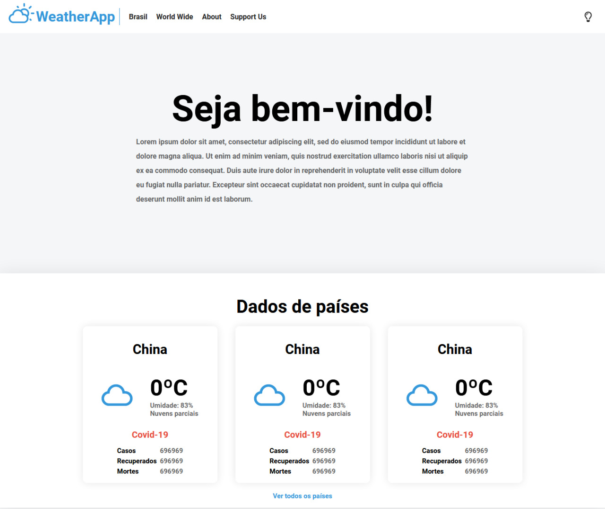
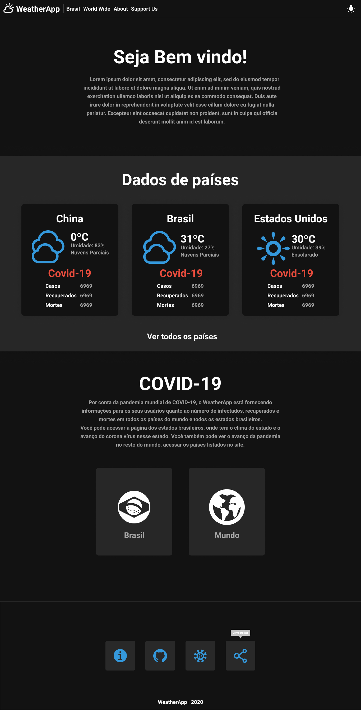

# WeatherApp  

> v0.1 ALPHA

O WeatherApp é um projeto desenvolvido pelos alunos da Escola Técnica Tupy, Pablo Lopes Caios Bornatto e Elias Kersten. O projeto consiste em uma aplicação Web desenvolvida em ReactJs e que tem o simples objetivo de informar para os usuários as condições climáticas sobre determinado local, e informar as condições e o avanço do COVID-19 dentro e fora do Brasil.

A aplicação consiste em básicamente cinco páginas, a página **Dashboard** simplesmente da as boas vindas à aplicação e mostra alguns dados de países escolhidos estaticamente. As outras duas páginas o usuário pode realmente ver os dados desejados, escolhendo entre **Brasil** e **Mundo**. A quarta página é **sobre** os desenvolvedores, apenas falando sobre nós, o projeto e os desenvolvedores das APIs que nos possibiliataram desenvolver essa aplicação (Obrigado! :)). A quinta e última página é o **Support Us** que redireciona o usuário para esse repositório no github, onde ele pode divulgar o projeto ou contribuir para o desenvolvimento dele após a publicação da versão LTS.

## Open Source

Esse é um projeto de código aberto! :D Isso significa que você pode baixa-lo na sua máquina, digitando o seguinte comando no seu Terminal: `git clone https://github.com/PabloLopes19/WeatherApp.git`. Você pode trazer novas funcionalidades e elas podem ser adicionadas na versão final da aplicação em futuras atualizações!

## Tecnologias usadas:

- [React Js](https://pt-br.reactjs.org/)
- [Node Js](https://nodejs.org/en/) 

## APIs usadas:

- [Weather](https://github.com/CaioBornatto/caiob-weahter-app)
- [COVID-19](https://covid19-brazil-api.now.sh/)

Dêem uma força para esse trabalho incrível que eles estão fazendo! :)

## UI/UX

# Dark Mode!!!! :D

# Devs

**[Pablo Lopes](https://github.com/PabloLopes19)**

- Dev React/React Native
- UI/UX
- Development and Art Director

**[Caio Bornatto](https://github.com/CaioBornatto)**

- Dev NodeJs
- Suporte React/React Native
- App Data Director

**[Elias Kersten](https://www.youtube.com/channel/UClSzLCvmkSRnFk-Rh0pX4Ig)**

- UI/UX
- Art and User Interface development
- Creative development